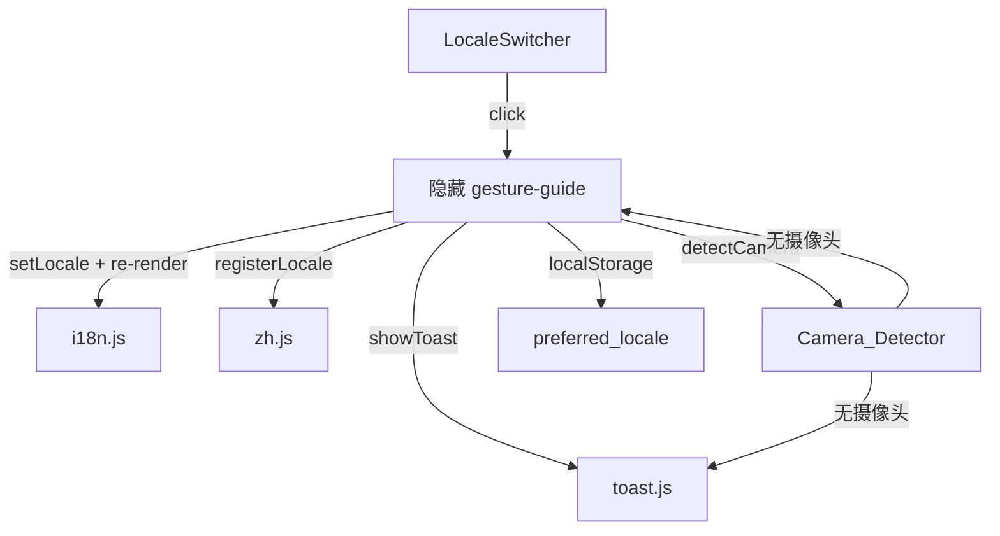
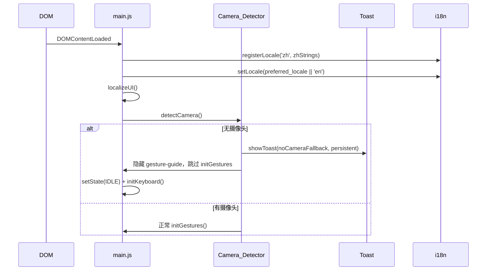

# 设计文档：Tarot App 升级

## 概述

本次升级在已完成重构的塔罗牌 Web 应用基础上，新增三项功能模块：

1. **中文语言包**：新增 `src/locales/zh.js`，覆盖 `en.js` 全部字符串键，并为 AI 解读提供中文提示词。
2. **运行时语言切换**：新增 `Locale_Switcher` UI 控件，支持运行时切换语言、`localStorage` 持久化偏好、切换后全量重渲染静态文字。
3. **Toast 通知组件**：新增 `src/toast.js`，统一封装所有一次性通知与操作反馈，替代散落在各处的 `statusText` 直接写入。
4. **摄像头检测与降级**：页面加载后立即检测摄像头，无摄像头时通过 Toast 提示并激活键盘/鼠标降级模式。
5. **现有提示迁移**：将摄像头权限拒绝、API 失败、设置保存等提示统一迁移至 Toast。

核心游戏逻辑（手势驱动卡牌轮播、三张选牌、AI 流式解读）保持不变。

---

## 架构

### 模块结构

```
tarot-app/
├── index.html              # 新增 #toast-container、Locale_Switcher 按钮
├── src/
│   ├── main.js             # 新增：Camera_Detector、localeSwitcher 初始化、Toast 调用
│   ├── toast.js            # 新增：Toast 通知组件
│   ├── i18n.js             # 不变：t()、setLocale()、registerLocale()
│   └── locales/
│       ├── en.js           # 不变：英文语言包
│       └── zh.js           # 新增：中文语言包
```

### 数据流



### 启动流程



---

## 组件与接口

### `src/toast.js`

```js
/**
 * 在 #toast-container 中显示一条通知。
 * @param {string} message       - 通知文字（空字符串时静默返回）
 * @param {'info'|'success'|'warning'|'error'|'persistent'} type
 * @param {number} [duration=3000] - 自动消失毫秒数（persistent 类型忽略）
 * @returns {string|null} toastId - 可传入 dismissToast() 主动关闭
 */
export function showToast(message, type = 'info', duration = 3000)

/**
 * 主动关闭指定 ID 的 Toast。
 * @param {string} id
 */
export function dismissToast(id)
```

**内部实现要点：**
- 在 `DOMContentLoaded` 前懒创建 `#toast-container`（若 HTML 中未预置则动态插入 `document.body`）
- 每个 Toast 元素携带唯一 `data-toast-id`
- `persistent` 类型：不设定时器，显示关闭按钮（×）
- 重复 `persistent` Toast（相同 message）：不新建，改为短暂添加 `flash` CSS 类
- 动画：CSS `@keyframes slideIn` / `slideOut`，通过 `classList` 切换触发

### `Locale_Switcher`（`index.html` + `main.js`）

HTML 结构（插入 `#header`）：
```html
<button id="locale-switcher" aria-label="Switch language">EN</button>
```

`main.js` 中的 `initLocaleSwitcher()` 函数：
- 读取 `localStorage.getItem('preferred_locale')` 初始化按钮文字
- 点击时：切换 `en` ↔ `zh`，调用 `setLocale()`，调用 `localizeUI()`，调用 `showToast(t('toast.localeSwitched'), 'success', 2000)`
- 将新语言写入 `localStorage('preferred_locale')`

### `Camera_Detector`（`main.js` 内函数）

```js
async function detectCamera(): Promise<boolean>
```

- 调用 `navigator.mediaDevices?.enumerateDevices()`
- 若 API 不可用：`showToast(t('toast.mediaApiUnavailable'), 'warning')` → 返回 `false`
- 若无 `videoinput`：`showToast(t('toast.noCameraFallback'), 'persistent')` → 返回 `false`
- 若有 `videoinput`：返回 `true`

### `src/locales/zh.js`

覆盖 `en.js` 全部键，额外新增 Toast 相关键：

```js
export default {
  // 新增 Toast 键（en.js 同步新增）
  'toast.noCameraFallback': '...',
  'toast.mediaApiUnavailable': '...',
  'toast.localeSwitched': '...',
  'toast.noApiKey': '...',
  'toast.settingsSaved': '...',
  // ... 其余全部 en.js 键的中文翻译
}
```

### `src/ai.js` 修改

`buildPrompt()` 改为接受语言参数，根据当前 locale 使用 `t('ai.systemPrompt')` 和 `t('ai.userPrompt')` 构建提示词：

```js
function buildPrompt(pickedCards) {
  // 使用 t('ai.systemPrompt') 和 t('ai.userPrompt') 替代硬编码英文
}
```

---

## 数据模型

### Toast 实例

```js
{
  id: string,          // crypto.randomUUID() 或时间戳
  message: string,
  type: 'info' | 'success' | 'warning' | 'error' | 'persistent',
  duration: number,    // ms，persistent 时为 Infinity
  element: HTMLElement
}
```

### 语言包结构（新增键）

`en.js` 和 `zh.js` 均需新增以下键：

```js
// Toast 通知
'toast.noCameraFallback': string,      // 无摄像头降级提示
'toast.mediaApiUnavailable': string,   // mediaDevices API 不可用
'toast.localeSwitched': string,        // 语言切换成功
'toast.noApiKey': string,              // 无 API Key 警告
'toast.settingsSaved': string,         // 设置保存成功

// AI 提示词（支持中文 AI 解读）
'ai.systemPrompt': string,             // 系统提示词
'ai.userPrompt': string,               // 用户提示词模板（含 {cards} 占位符）

// 语言切换控件
'locale.en': string,                   // 'EN'
'locale.zh': string,                   // '中文'
```

### localStorage 键

| 键名 | 类型 | 说明 |
|---|---|---|
| `deepseek_token` | string | 已有：DeepSeek API Key |
| `preferred_locale` | `'en'` \| `'zh'` | 新增：用户语言偏好 |

---

